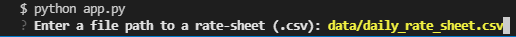

# Enhanced Loan Qualifier Application

This project is designed to provide a user the ability to filter a list of loans in which they qualify for from a list of banks. After completing the filter, the user has the choice to save the list of qualifying loans to a csv file.

---

## Technologies

This program utilizes Python 3.7 with the following packages:

- [Fire](https://github.com/google/python-fire) to create a CLI (command line interface) in order to improve usabiltiy and debugging of code
- [Questionary](https://github.com/tmbo/questionary) to build interactive CLIs to obtain user input 
- [csv](https://docs.python.org/3.7/library/csv.html) to read and write CSV files
- [sys](https://docs.python.org/3/library/sys.html) to allow quick exit of the program if certain conditions are met
- [Path](https://docs.python.org/3.7/library/pathlib.html) from pathlib library to create a location for a file on your computer

---

## Installation guide

Install Fire using the following pip command:

```python
  pip install fire
```
Install Questionary using the following pip command:

```python
  pip install questionary
```

---

## Usage

To use the application, clone the repository and run the application with the following command:

```python
  python app.py
```
Upon running, you will be asked to enter a file path to obtain the daily rate sheet:




---

## Contributors


---

## License